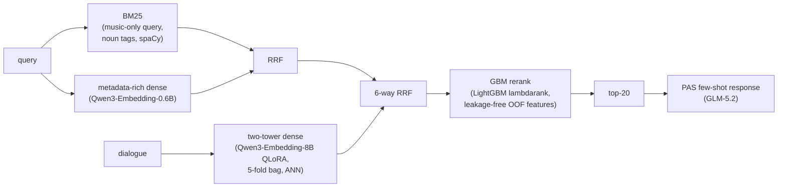

# Music-CRS Challenge 2026 — Final Submission

Conversational music recommendation (ACM RecSys Challenge 2026).
Dialogue turns + user profile → top-20 track retrieval + a natural-language response.

Competition result: [4th place](https://nlp4musa.github.io/music-crs-challenge/results.html) as Team swyoo.

Final pipeline (TID `ensemble__bm25_qmr-qemb_twotower_8b__gbm`):



Only public dependencies: HuggingFace `talkpl-ai/TalkPlayData-Challenge-*` datasets,
Ollama `qwen3-embedding:0.6b`, `Qwen/Qwen3-Embedding-8B`, LightGBM, and any
OpenAI-compatible chat API for responses (we use z.ai `glm-5.2`).

## External platform — z.ai (GLM-5.2 response generation)

The response-generation step is the only part of the pipeline that calls an
external, paid platform. It uses [Z.ai's commercial API](https://docs.z.ai/api-reference/llm/chat-completion),
an OpenAI-compatible chat endpoint, to run `glm-5.2` (the internal training/serving
catalog name `zai-org/glm-5.2-fp8` refers to the same model family; the public API
uses `glm-5.2`). Z.ai does not offer an embeddings API, so all embedding calls
(`metadata-rich` retrieval and PAS demo matching) stay on the local Ollama
`qwen3-embedding:0.6b` model — there is no external embedding dependency.

Required environment variables (see `.env.example`):

| Variable | Value | Why |
|---|---|---|
| `MYMODULE_CHAT_PROVIDER` | `openai` | Routes response generation through the OpenAI-compatible client; the default is `ollama`, so this must be set explicitly |
| `MYMODULE_LLM_OPENAI_URL` | `https://api.z.ai/api/paas/v4` | Z.ai chat-completions base URL |
| `MYMODULE_LLM_OPENAI_MODEL` | `glm-5.2` | Public API model name |
| `MYMODULE_LLM_OPENAI_API_KEY` | *(your z.ai key)* | Bearer-token auth, OpenAI-compatible |
| `MYMODULE_LLM_MAX_TOKENS` | `32768` | GLM-5.2 is a reasoning model; a lower budget (e.g. 1024/3000) truncates output to an empty response |

`bin/stage1_inference.sh` already sets sane defaults for all of the above except
the API key. To verify retrieval alone without a z.ai key, run with
`RESPONSE_GEN=noop` (see Stage 1 below).

## Technical References

The final system combines BM25 sparse retrieval, Qwen3 dense retrieval, RRF fusion,
Qwen3-Embedding two-tower QLoRA training with multi-positive InfoNCE/logQ correction,
LightGBM LambdaRank reranking, and PAS-style grounded response generation.

See [docs/technical-references.md](docs/technical-references.md).

## Setup

For a fresh checkout, use the GitHub repository as the source workspace:

```bash
git clone https://github.com/yoobros/music-crs-challenge.git
cd music-crs-challenge
```

```bash
uv sync                                   # Python 3.12, managed by uv
ollama pull qwen3-embedding:0.6b          # local embedding server
cp .env.example .env                      # fill in the chat-API key
```

Download only the artifact bundle from the
[HuggingFace artifact repository](https://huggingface.co/datasets/yoobros/music-crs-2026-final)
and extract it at the repo root. It places feature stores, model weights,
caches, and training data at their expected paths:

```bash
hf download yoobros/music-crs-2026-final repro-bundle-final-8b-gbm.tar.gz \
  --repo-type dataset --local-dir .
tar xzf repro-bundle-final-8b-gbm.tar.gz -C .
```

## HuggingFace Artifacts

The [HuggingFace artifact repository](https://huggingface.co/datasets/yoobros/music-crs-2026-final)
hosts `repro-bundle-final-8b-gbm.tar.gz` for this GitHub checkout. The bundle
contains the submitted weights, feature stores, caches, training data, and
GBM/PAS artifacts needed for inference and reproducibility checks.

It is an artifact store rather than a row-wise dataset, so the Dataset Viewer is
disabled intentionally.

Generated submission outputs such as `prediction.json`, `submission.zip`, and
`mymodule/exp/` are intentionally excluded. Stage 1 regenerates them from
Blind-Dataset-B.

## Stage 1 — Inference (Blind-B → predictions.json)

```bash
# Equivalent helper: bin/stage1_inference.sh
uv run python -m mymodule.run_inference_blindset \
  --tid ensemble__bm25_qmr-qemb_twotower_8b__gbm --eval_dataset blindset_B
# → mymodule/exp/inference/blindset_B/prediction.json (+ submission.zip)
```

Runs on CPU: bundled per-fold query caches serve the 8B query vectors without loading
the encoder (~20 s retrieval for 80 sessions). Only the response step calls the chat API;
use `--response-gen noop` to check retrieval alone.

For the submitted full-response file we repackaged the generated responses with
`scripts/package_submission.py --pad-lexical 0.98` (the stage1 helper does this
by default). This deterministic post-processing appends a trailing `#tags`
block made from real music tags arranged to avoid repeated bigrams. It leaves
the top-20 track IDs untouched and uses a conservative target so the readable
response remains the primary content. The goal is only to stabilize the official
Distinct-2 / lexical-diversity component because an 80-row response batch tends
to reuse friendly recommendation phrases even when the recommendations are
properly grounded.

## Stage 2 — Train from scratch

Quick smoke check:

```bash
bin/stage2_smoke.sh
```

The smoke script verifies the GLM-5.2 query/doc text generators, an Ollama
metadata-rich embedding call, and the training/GBM CLI entrypoints. It does not
rebuild OOF features by default: the final OOF rebuild needs fold-specific
`train` query-vector caches, or else it will load the 8B encoder.

Dependency order: feature stores → query summaries/training data → two-tower
8B (5 folds) → doc caches → query caches → OOF → GBM.
The artifact bundle already contains the submitted feature stores, query
summaries, trained adapters, doc/query caches for devset/Blind-B inference, and
the GBM checkpoint.
Run the commands below only when rebuilding those artifacts.

```bash
# 1) Feature stores (KV + LanceDB + metadata-rich embeddings; Ollama required)
uv run python -m mymodule.feature.kvdb  --build
uv run python -m mymodule.feature.kvdb  --build-crawl     # loads bundled lyrics/tags JSONL
uv run python -m mymodule.feature.store --build
uv run python -m mymodule.feature.store --build-metadata-rich
# (the BM25 cache builds itself on first use)

# Query-side text cache (`Session so far:` line in two-tower queries).
# The bundle ships `query_summaries.jsonl`; keep it for exact query composition.
# Regenerate only if you intentionally rebuild preprocessing data.
for ds in train devset blindset_B; do
  uv run python -m mymodule.strategies.twotower.query_summary \
    --dataset $ds --provider openai --model glm-5.2
done

# 2) Two-tower 8B QLoRA, 5-fold CV (fold i held out).
# Submitted folds were trained on one L40S GPU with batch size 48.
for i in 0 1 2 3 4; do
  CUDA_VISIBLE_DEVICES=0 uv run python -m mymodule.strategies.twotower.train \
    --base-model Qwen/Qwen3-Embedding-8B \
    --data mymodule/strategies/twotower/data/train_full.jsonl \
    --run-name qwen3emb8b_qlora --qlora --no-ddp \
    --num-folds 5 --fold-idx $i --split-seed 42 \
    --batch-size 48 --epochs 2 --lr 2e-4 --temperature 0.05 \
    --lora-r 32 --lora-alpha 64 --lora-dropout 0.1 \
    --max-len 256 --compose qd --grad-checkpoint
done

# 3) Per-fold doc caches
for i in 0 1 2 3 4; do
  uv run python -m mymodule.strategies.twotower.doc_cache \
    --base-model Qwen/Qwen3-Embedding-8B \
    --adapter mymodule/strategies/twotower/ckpt/qwen3emb8b_qlora_fold${i}_epoch2 \
    --out mymodule/strategies/twotower/data/doc_cache_qwen3emb8b_qlora_fold${i}.npz \
    --encode-batch 8
done

# 4) Per-fold query-vector caches
# These cache 8B query vectors by composed-query hash. They let CPU validation
# and OOF feature rebuilds reuse fold-specific query vectors without loading
# every 8B adapter at retrieval time.
for i in 0 1 2 3 4; do
  # `train` is needed only when rebuilding OOF features; devset/Blind-B are
  # used by evaluation and Stage-1 validation inference.
  for ds in train devset blindset_B; do
    CUDA_VISIBLE_DEVICES=0 uv run python -m mymodule.strategies.twotower.query_cache \
      --base-model Qwen/Qwen3-Embedding-8B \
      --adapter mymodule/strategies/twotower/ckpt/qwen3emb8b_qlora_fold${i}_epoch2 \
      --dataset $ds \
      --out mymodule/strategies/twotower/data/query_cache_qwen3emb8b_qlora_fold${i}_${ds}.npz \
      --device cuda --dtype bfloat16 --encode-batch 8
  done
done

# 5) Leakage-free OOF features → GBM reranker
uv run python -m mymodule.strategies.rerank.gbm.build_features --tid ensemble__bm25_qmr-qemb_twotower_8b__gbm
uv run python -m mymodule.strategies.rerank.gbm.train         --tid ensemble__bm25_qmr-qemb_twotower_8b__gbm
```

Training inputs shipped in the bundle: `train_full.jsonl` (121,592 query/positive-doc
pairs), `doc_text_map_qd.jsonl` (47,071-track catalog text), tag/metadata maps, and the
query-side caches (`query_summaries.jsonl`, per-fold devset/Blind-B query-vector
caches). Train query-vector caches and OOF feature tables are regenerated when
running the full GBM rebuild path.

## Evaluation (devset)

```bash
uv run python -m mymodule.run_inference_devset --tid ensemble__bm25_qmr-qemb_twotower_8b__gbm
uv run python scripts/evaluate_by_turn.py     --tid ensemble__bm25_qmr-qemb_twotower_8b__gbm
```

## Layout

```
mymodule/
  run_inference_blindset.py    # Blind-B → predictions.json
  run_inference_devset.py
  strategies/                  # bm25 · qemb · twotower(8B) · ensemble · gbm rerank · PAS response
  feature/                     # KV / LanceDB / BM25 feature stores
  cv/                          # shared K-fold splitter
scripts/                       # evaluation & packaging helpers
```
